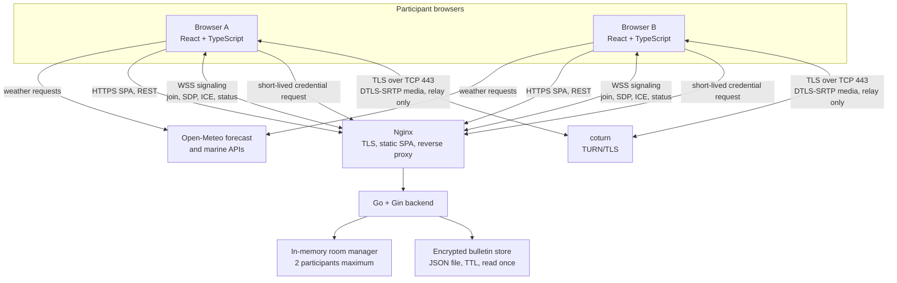

# Privacy-Aware WebRTC Prototype application

A self-hosted, two-person WebRTC calling prototype with audio/video rooms, a Go signaling service, relay-only TURN connectivity, and client-encrypted one-time bulletins. The current interface is presented as a Black Sea weather site; its search field opens a call room from an agreed access phrase.

> This is a research prototype, not an independently audited secure-messaging product. Do not rely on it as a replacement for established, audited communication tools.

## What it does

- Creates ephemeral rooms for at most two participants, with audio-only and video modes.
- Uses WebSocket signaling for room membership, SDP/ICE exchange, presence, and call termination.
- Uses WebRTC with `iceTransportPolicy: "relay"`, so media is relayed through TURN rather than sent peer-to-peer.
- Uses HTTPS/WSS and, by default, TURN-over-TLS on TCP 443 (`turns:<realm>:443?transport=tcp`), so browser-facing application, signaling, credential, and relay traffic uses the same port commonly used for HTTPS rather than direct UDP relay ports.
- Requests short-lived TURN REST credentials from the backend; no static TURN password is shipped to the frontend.
- Displays DTLS fingerprints as short codes so participants can manually verify and remember a peer identity for the current browser context.
- Offers one-time bulletins: the browser derives a key from a mailbox code, encrypts the note with AES-GCM, and the backend stores only the ciphertext envelope until it is read, expires, or reaches its failed-attempt limit.
- Serves English, Russian, and Turkish UI translations and uses Open-Meteo APIs for the cover-site weather data.

## Architecture



The signaling backend does not relay call media. It coordinates the two browsers and issues TURN credentials; coturn relays the WebRTC media path. In the documented production topology, Nginx uses SNI routing to share public TCP port 443 between the HTTPS site and coturn's TURN/TLS listener. Nginx is intended to expose the static frontend, `/api/*`, and `/ws` while the Go process binds to loopback in production.

## Repository layout

| Path | Purpose |
| --- | --- |
| `frontend/` | Vite, React, TypeScript, Chakra UI application and browser-side WebRTC/crypto logic. |
| `backend/` | Go/Gin HTTP and WebSocket signaling server, room lifecycle management, TURN credentials, bulletins, and i18n endpoints. |
| `VPS-SETUP-GUIDE.md` | Nginx, coturn, TLS, firewall, and deployment guidance for a VPS. |
| `local-deploy.sh` | Builds the frontend and Linux AMD64 backend, uploads them, then swaps the deployed artifacts. |
| `.github/workflows/deploy.yaml` | GitHub Actions build-and-deploy workflow for `main`. |

## Local development

Prerequisites: a current Go toolchain compatible with `backend/go.mod`, Node.js/npm, and a reachable coturn instance for a usable call. The frontend requires `/api/turn-credentials`; it intentionally fails closed when TURN credentials are absent.

1. Create local configuration from the template and supply a TURN shared secret/realm that match coturn:

   ```bash
   cp .env.example .env
   ```

2. In one terminal, load the backend configuration and start the backend. `BACKEND_ADDR` defaults to `127.0.0.1:8080`:

   ```bash
   cd backend
   set -a
   source ../.env
   set +a
   go run .
   ```

3. In another terminal, install frontend dependencies and start Vite. Its development proxy forwards `/api` and `/ws` to port 8080:

   ```bash
   cd frontend
   npm ci
   npm run dev
   ```

4. Open the Vite URL, create or enter the same room from two browser sessions, and allow microphone/camera access. Configure `TURN_SHARED_SECRET` and `TURN_REALM` in the backend environment before starting it; see the environment table below.

### Checks

```bash
cd backend && go test ./...
cd frontend && npm run lint && npm run build
```

## Runtime configuration

| Variable | Purpose | Default |
| --- | --- | --- |
| `BACKEND_ADDR` | Full listener address for the Go server. | `127.0.0.1:8080` |
| `PORT` | Listener port if `BACKEND_ADDR` is unset. | `8080` |
| `CORS_ORIGIN` | Comma-separated allowed WebSocket origins in addition to local Vite. | none |
| `TURN_SHARED_SECRET` | TURN REST shared secret; must equal coturn's `static-auth-secret`. | required for calls |
| `TURN_REALM` | TURN realm/server name. | required for calls |
| `TURN_TTL_SECONDS` | Lifetime for issued TURN credentials; clamped to 60–3600 seconds. | `600` |
| `TURN_URLS` | Comma-separated TURN URLs returned to browsers. Changing this can select another transport/port. | `turns:<TURN_REALM>:443?transport=tcp` |
| `BULLETIN_STORE_PATH` | Encrypted bulletin JSON file path. | OS config directory, or temp directory |
| `BULLETIN_TTL_MINUTES` | Bulletin retention duration. | `4320` (72 hours) |

For production configuration, including coturn, TLS, firewall rules, hairpin-relay networking, logging, systemd, and deployment, follow [VPS-SETUP-GUIDE.md](VPS-SETUP-GUIDE.md).

## Security boundaries and limitations

- The default browser-facing transport uses HTTPS/WSS and TURN/TLS over TCP 443. It does not expose direct browser-to-browser UDP media paths; a `TURN_URLS` override can intentionally change this behavior. Internal server relay ports and firewall/NAT handling are still required by the coturn deployment—see the VPS guide.
- WebRTC media uses DTLS-SRTP and remains encrypted end-to-end between the browser peers while coturn relays the encrypted packets; coturn does not terminate the media encryption. This does not make the application an audited end-to-end messaging system or authenticate the peer on its own.
- Fingerprint codes are useful only when participants compare them over a trusted, independent channel. A code not compared out of band does not authenticate the peer.
- Room identifiers are short hashes derived in the frontend and the weather-style entry UI is an interface convention, not an authentication or authorization boundary.
- The signaling service can observe connection metadata and signaling messages. TURN and reverse-proxy services can also retain operational metadata unless their logs and retention are deliberately configured.
- Bulletin plaintext and keys remain in the browser, but passphrase strength is vital: the server holds a verifier and encrypted envelope, not an access-control system. Bulletins are read-once and are deleted after three failed access attempts or expiration.
- The service has no user accounts, rate limiting, persistence for active rooms, security audit, or formal threat model in this repository.


## Deployment

`local-deploy.sh` reads the gitignored `.env`, cross-compiles the backend for Linux AMD64, builds the SPA, and deploys it to a configured VPS. The GitHub Actions workflow provides the equivalent production path from `main`. Video assets under `frontend/public/media/optimized/` are deliberately managed outside Git and must be placed on the server separately.

Before deploying, provision HTTPS, coturn, the firewall, and systemd according to [VPS-SETUP-GUIDE.md](VPS-SETUP-GUIDE.md). Never commit `.env` or TURN shared secrets.
